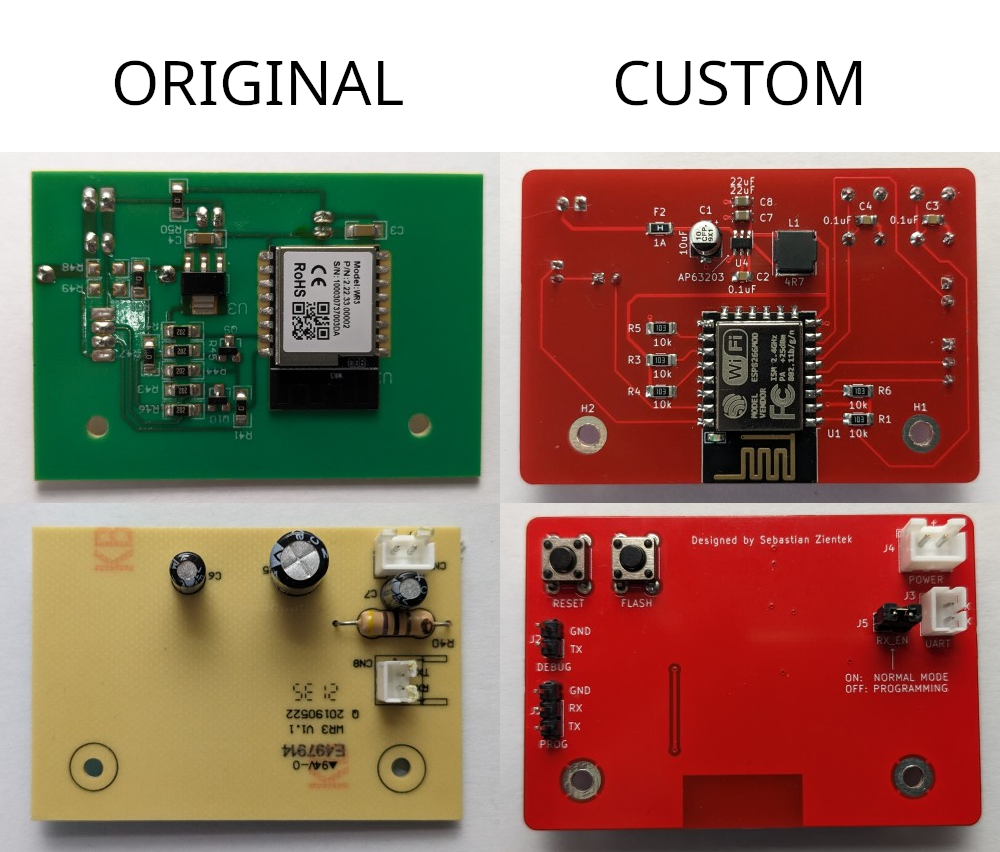
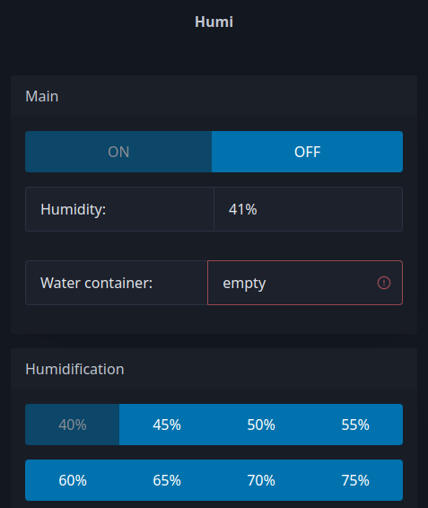

# Klarta Humea WiFi Module Replacement

## Overview

This project offers a replacement WiFi module for the Klarta Humea humidifier, enabling users to control the device via a web interface. The project is written in C++ and utilizes the ESP8266 platform.

## Features

### Impltemented
- Web-based control interface for managing the humidifier remotely.
- Custom PCB.

### Planned
- Update firmware by OTA (On The Air)
- Control device over MQTT (allows integration with Home Assistant).

## PCB


## Web configuration portal


## Disclaimer

**Use at Your Own Risk**: This project is created for fun. While it works for me, I'm not an electronic engineer so keep in mind that PCB design can have mistakes.

## Getting Started

### Prerequisites

- [PlatformIO](https://platformio.org/) installed on your development environment (platformio-core or as plugin to your IDE).
- USB to TTL adapter for flashing the firmware.
- Prepared PCB (gerber files under pcb directory, values of components included on silkscreen)

### Firmware preparation
1. Clone this repository to your local machine:

   ```bash
   git clone https://github.com/SebastianZientek/Humi.git
   ```

2. Navigate to the project directory:

   ```bash
   cd Humi
   ```

### Flashing firmware

1. Connect the USB to TTL adapter to the `PROG` header on the custom PCB.

2. Connect the USB to TTL adapter to your computer.

3. Power on the Klarta Humea humidifier with the replacement WiFi module installed.

4. Disconnect jumper RX_EN.

5. Build and upload firmware to the board:

   ```bash
   pio run -t upload
   ```
6. Connect jumper back.

### First setup

1. Power on the Klarta Humea humidifier with the replacement WiFi module installed.
2. Connect to network hosted by humidifier (ssid: HumiConnectToWiFi).
3. Open a web browser and navigate to the `http://192.168.4.1`.
4. Set up wifi network that humidifier should use.

## Custom PCB

Custom PCB designs are provided under `PCB` directory. These files can be used to manufacture the replacement WiFi module PCB.

## License

This project is licensed under the [MIT License](LICENSE).
